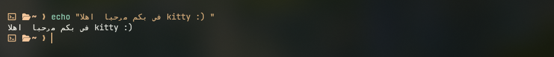
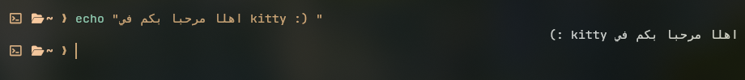

# kitty-rtl: BiDi (Arabic & Hebrew) Support for Kitty Terminal

A fork of the fast, GPU-based [kitty](https://github.com/kovidgoyal/kitty) terminal emulator adding zero-overhead bidirectional (BiDi) text rendering for Arabic and Hebrew.

> **Upstream Documentation:** For the original upstream Kitty documentation, FAQ, and official project links, see [docs/UPSTREAM_README.md](docs/UPSTREAM_README.md) or visit the official [kitty website](https://sw.kovidgoyal.net/kitty/).

---

## Why this fork?

In official releases of Kitty, Arabic and Hebrew characters can often be shaped by HarfBuzz, but the terminal grid has no line-level bidirectional reordering algorithm (BiDi). As a result:

* Right-to-Left (RTL) words are displayed in reverse (Left-to-Right order), e.g., the beginning of the sentence is placed on the left side of the screen.
* Mixed RTL and LTR text (such as Arabic sentences containing English words, commands, or file paths) becomes scrambled and difficult to read.
* Paired punctuation and brackets appear reversed in RTL context.

This design decision and the philosophical discussions around terminal cell grids vs. bidirectional layout are well-documented upstream in [kovidgoyal/kitty#2109](https://github.com/kovidgoyal/kitty/issues/2109).

This fork provides a lightweight, pragmatic rendering-layer patch to display Arabic and Hebrew naturally inside Kitty while keeping Kitty's signature blazing-fast performance.

---

## What's Different from Upstream Kitty?

All changes in this fork are confined to the rendering layer and do not alter Kitty's underlying terminal screen buffers or state machines:

1. **FriBidi Integration (`setup.py`, `kitty/bidi.c`, `kitty/bidi.h`)**
   * Integrates the standard GNU FriBidi library into Kitty's native C build pipeline.
   * Performs Arabic joining, presentation form resolution (Forms B), and Unicode bidirectional reordering at the visual line level.

2. **Zero-Overhead Fast-Path for LTR Lines (`line_has_bidi`)**
   * Before allocating or reordering, every line passes through a lightweight check (`line_has_bidi`) inspecting codepoint ranges (`U+0590..U+08FF`, `U+FB1D..U+FDFF`, `U+FE70..U+FEFF`).
   * Pure English, code, ASCII, and Asian scripts bypass all BiDi processing entirely with **zero memory allocations** and **zero performance impact**.

3. **Stack Buffer Allocation**
   * Standard terminal widths (up to 1024 columns) utilize pre-allocated stack buffers during reordering, completely avoiding heap `malloc`/`free` churn during active rendering.

4. **Lam-Alef Ligature Suppression (`kitty/fonts.c`)**
   * In standard monospace terminal grids, HarfBuzz OpenType features (`rlig` / `liga`) often collapse adjacent Lam and Alef cells into a single 1-cell glyph, leaving the adjacent cell blank (rendering as an unwanted gap inside words like `السلام` or `الان`).
   * On BiDi lines, `-rlig`, `-liga`, `-dlig`, and `-calt` are selectively suppressed during HarfBuzz shaping. Both Lam and Alef render in their own respective cells and connect seamlessly in cursive script without blank gaps or artificial Tatweel (`ـ`) insertions.

5. **Bracket & Punctuation Mirroring (`fribidi_shape_mirroring`)**
   * Paired characters such as `()`, `[]`, and `{}` are automatically mirrored according to their RTL embedding levels.

6. **Visual Cursor Position Mapping (`kitty/shaders.c`)**
   * The GPU cursor coordinates are dynamically mapped from logical cell coordinates to visual reordered coordinates (`bidi_log2vis`), so the cursor follows the active editing point accurately in Arabic text.

---

## Before & After

| Upstream Kitty (LTR scrambled) | kitty-rtl (Natural BiDi rendering) |
| :---: | :---: |
|  |  |

---

## Installation & Building from Source

### Prerequisites

#### Arch Linux / EndeavourOS / Manjaro:
```bash
sudo pacman -S --needed base-devel git python harfbuzz freetype2 fribidi libpng zlib libx11 libxrandr libxinerama libxcursor libxkbcommon wayland wayland-protocols
```

#### Ubuntu / Debian (22.04+):
```bash
sudo apt update
sudo apt install -y build-essential git python3-dev libharfbuzz-dev libfreetype-dev libfribidi-dev libpng-dev libx11-dev libxrandr-dev libxinerama-dev libxcursor-dev libxkbcommon-dev libxkbcommon-x11-dev libwayland-dev wayland-protocols
```

#### Fedora:
```bash
sudo dnf install -y gcc git python3-devel harfbuzz-devel freetype-devel fribidi-devel libpng-devel libX11-devel libXrandr-devel libXinerama-devel libXcursor-devel libxkbcommon-devel libxkbcommon-x11-devel wayland-devel wayland-protocols-devel
```

---

### Building

1. **Clone the repository:**
   ```bash
   git clone https://github.com/t40ix/kitty-rtl.git
   cd kitty-rtl
   ```

2. **Build Kitty:**
   ```bash
   python3 setup.py build
   ```

3. **Run the built executable:**
   ```bash
   ./kitty/launcher/kitty
   ```

4. *(Optional)* Install system-wide or create a symlink:
   ```bash
   # Create a user binary symlink
   mkdir -p ~/.local/bin
   ln -sf "$(pwd)/kitty/launcher/kitty" ~/.local/bin/kitty-rtl
   ```

---

## Recommended Font Configuration

Because monospace Arabic rendering relies on exact cell proportions, some fonts (such as Cairo or standard proportional fonts) may show cuts or misalignments. The tested and recommended monospace font is **DejaVu Sans Mono**.

Add the following to your `~/.config/kitty/kitty.conf` to map Arabic Unicode ranges cleanly:

```conf
# ~/.config/kitty/kitty.conf

# Symbol map for Arabic blocks to DejaVu Sans Mono
symbol_map U+0600-U+06FF,U+0750-U+077F,U+08A0-U+08FF,U+FB50-U+FDFF,U+FE70-U+FEFF DejaVu Sans Mono
```

---

## Known Limitations

This patch is a pragmatic, rendering-level solution. Users should be aware of the following:

* **Full-Screen TUI Applications:** Complex terminal user interfaces (such as `htop`, `tmux`, or file managers like `midnight-commander`) that manually position text at exact terminal columns may exhibit unexpected layout behavior if Arabic text is embedded in fixed-width tabular UI elements.
* **Mouse Selection:** Text selection with the mouse across reordered BiDi boundaries remains tied to Kitty's underlying logical cell indices rather than visual screen coordinates.
* **Line-Level Scope:** The reordering operates per terminal row. Multi-line wrapped paragraphs are treated as individual visual lines.
* **Experimental Status:** This is a community fork maintained for everyday terminal and shell productivity, not an officially supported upstream feature.

---

## Relation to Upstream Kitty

This project is an independent fork and is **not affiliated with, endorsed by, or supported by Kovid Goyal or the official Kitty development team**.

We hold deep respect for Kitty's codebase, architecture, and maintainers. This fork exists to serve Arabic and Hebrew speakers who love Kitty's speed and GPU rendering, pending any future upstream standards or solutions.

---

## License

Like upstream Kitty, this project is licensed under the **GNU General Public License v3.0 (GPL-3.0)**. See the [LICENSE](LICENSE) file for details.
